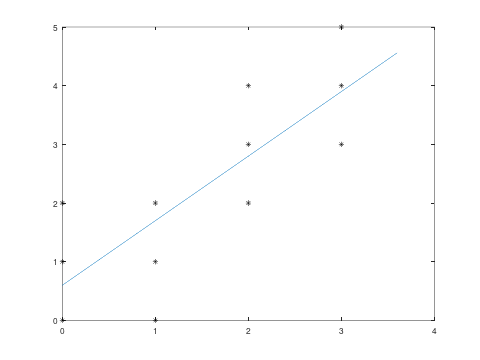
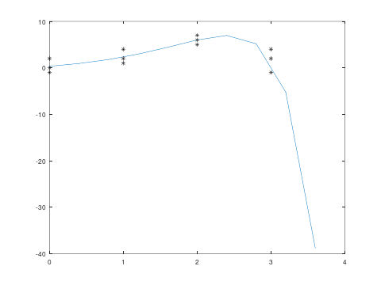
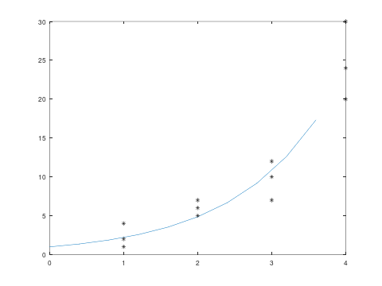
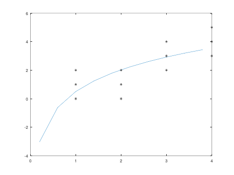
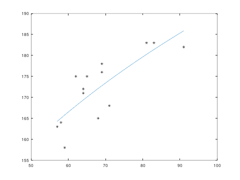

<div align="center">
<h1>regression</h1>
<br/>
<br/>
<p>
regression is a Go package containing a collection of linear least-squares fitting methods for simple data analysis.
</p>
</div>

## Installation
```go get github.com/antonsegerkvist/regression```
or use your favorite dependency management tool.

## Usage

All the regression structures has a similar API. The regression structure is best
created using the constructor methods, ex ```NewLinearRegression32```. Following
that the structure is trained using the method ```regressionStrcture.Train(data)```
and then the regressed values can be calculated at any ```x``` value using the
```regressionStrcture.Predict``` method.

### Example

```go
package main

import (
	"fmt"

	"github.com/antonsegerkvist/regression"
)

func main() {

	points := 10

	data := []regression.Point32{
		{X: 0, Y: 0},
		{X: 0, Y: 1},
		{X: 0, Y: 2},
		{X: 1, Y: 1},
		{X: 1, Y: 2},
		{X: 1, Y: 0},
		{X: 2, Y: 2},
		{X: 2, Y: 3},
		{X: 2, Y: 4},
		{X: 3, Y: 3},
		{X: 3, Y: 4},
		{X: 3, Y: 5},
	}

	regression32 := regression.NewLinearRegression32()
	regression32.Train(&data)

	x := []float32{}
	y := []float32{}
	for i := 0; i < points; i++ {
		x = append(x, 4.0/float32(points)*float32(i))
		y = append(y, regression32.Predict(4.0/float32(points)*float32(i)))
	}

	for _, v := range x {
		fmt.Printf("%f ", v)
	}
	fmt.Println("")

	for _, v := range y {
		fmt.Printf("%f ", v)
	}
	fmt.Println("")

}
```

## API Reference
- [Linear](#regressionLinear)
- [Polynomial](#regressionPolynomial)
- [Exponential](#regressionExponential)
- [Logarithmic](#regressionLogarithmic)
- [Power](#regressionPower)

<a name="regressionLinear" href="#regressionLinear">#</a> regression.<b>NewLinearRegression32</b>() ·
[Source](https://github.com/antonsegerkvist/regression/blob/master/regression.go "Source"),
[Example](https://github.com/antonsegerkvist/regression/blob/master/examples "Example")
<br>
<a href="#regressionLinear">#</a> regression.<b>NewLinearRegression64</b>() ·
[Source](https://github.com/antonsegerkvist/regression/blob/master/regression.go "Source"),
[Example](https://github.com/antonsegerkvist/regression/blob/master/examples "Example")

Creates a new linear regression structure with a zero coefficient vector.




<a name="regressionPolynomial" href="#regressionPolynomial">#</a> regression.<b>NewPolynomialRegression32</b>(order) ·
[Source](https://github.com/antonsegerkvist/regression/blob/master/regression.go "Source"),
[Example](https://github.com/antonsegerkvist/regression/blob/master/examples "Example")
<br>
<a href="#regressionPolynomial">#</a> regression.<b>NewPolynomialRegression64</b>(order) ·
[Source](https://github.com/antonsegerkvist/regression/blob/master/regression.go "Source"),
[Example](https://github.com/antonsegerkvist/regression/blob/master/examples "Example")

Creates a new polynomial regression structure of order ```order``` and with a zero coefficient vector.




<a name="regressionExponential" href="#regressionExponential">#</a> regression.<b>NewExponentialRegression32</b>() ·
[Source](https://github.com/antonsegerkvist/regression/blob/master/regression.go "Source"),
[Example](https://github.com/antonsegerkvist/regression/blob/master/examples "Example")
<br>
<a href="#regressionExponential">#</a> regression.<b>NewExponentialRegression64</b>() ·
[Source](https://github.com/antonsegerkvist/regression/blob/master/regression.go "Source"),
[Example](https://github.com/antonsegerkvist/regression/blob/master/examples "Example")

Creates a new exponential regression structure with a zero coefficient vector.



<a name="regressionLogarithmic" href="#regressionLogarithmic">#</a> regression.<b>NewLogarithmicRegression32</b>() ·
[Source](https://github.com/antonsegerkvist/regression/blob/master/regression.go "Source"),
[Example](https://github.com/antonsegerkvist/regression/blob/master/examples "Example")
<br>
<a href="#regressionLogarithmic">#</a> regression.<b>NewLogarithmicRegression64</b>() ·
[Source](https://github.com/antonsegerkvist/regression/blob/master/regression.go "Source"),
[Example](https://github.com/antonsegerkvist/regression/blob/master/examples "Example")

Creates a new logarithmic regression structure with a zero coefficient vector.



<a name="regressionPower" href="#regressionPower">#</a> regression.<b>NewPowerRegression32</b>() ·
[Source](https://github.com/antonsegerkvist/regression/blob/master/regression.go "Source"),
[Example](https://github.com/antonsegerkvist/regression/blob/master/examples "Example")
<br>
<a href="#regressionPower">#</a> regression.<b>NewPowerRegression64</b>() ·
[Source](https://github.com/antonsegerkvist/regression/blob/master/regression.go "Source"),
[Example](https://github.com/antonsegerkvist/regression/blob/master/examples "Example")

Creates a new power regression structure with a zero coefficient vector.

